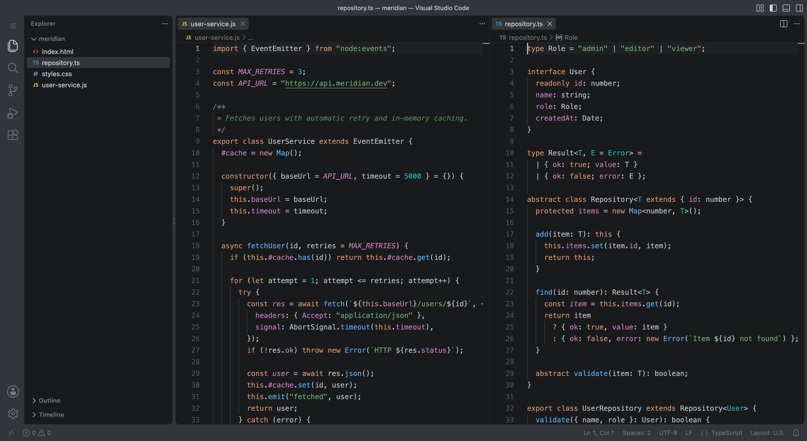
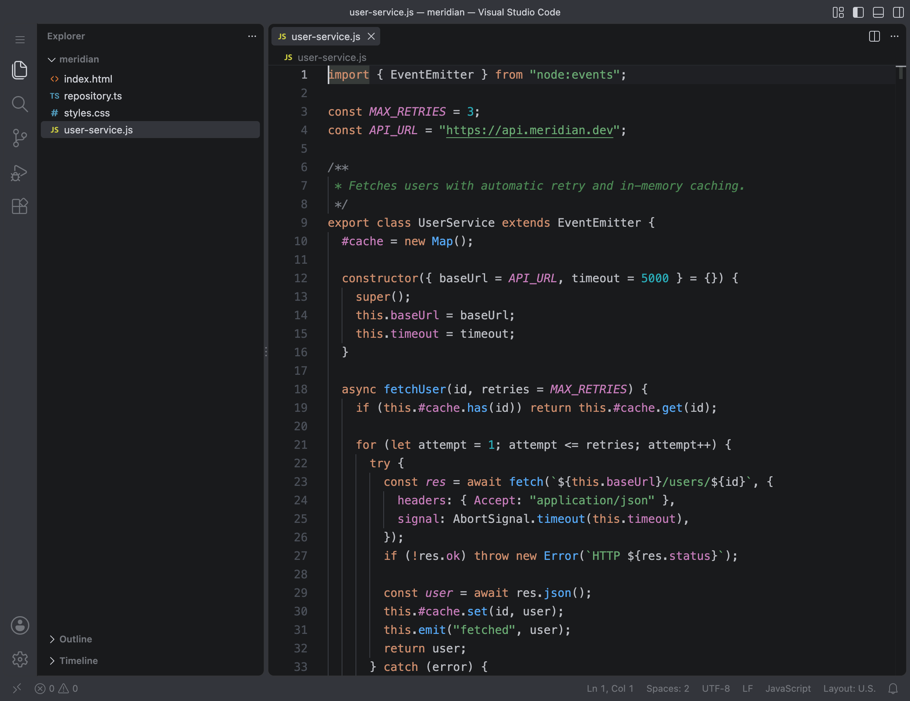
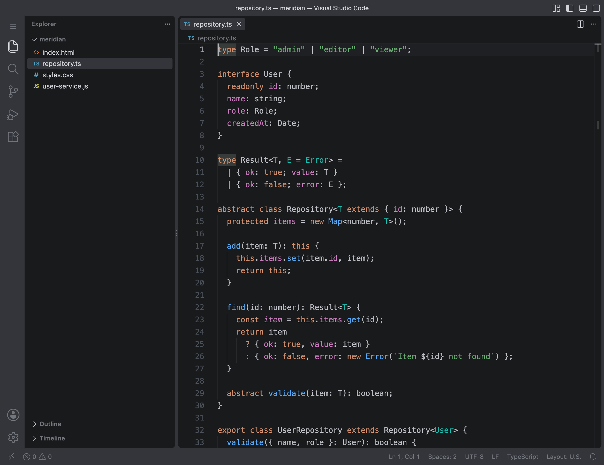
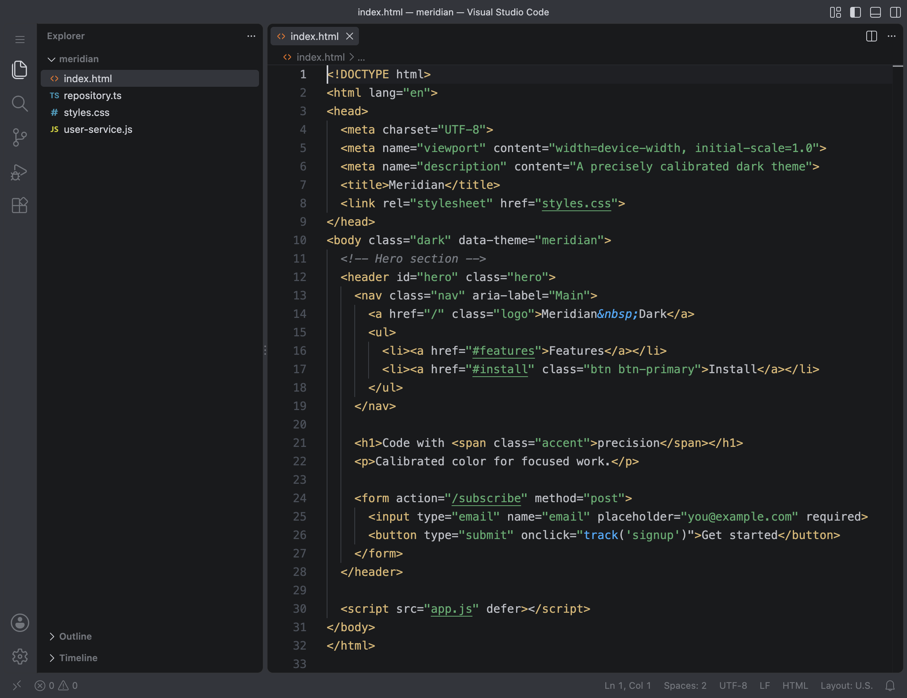
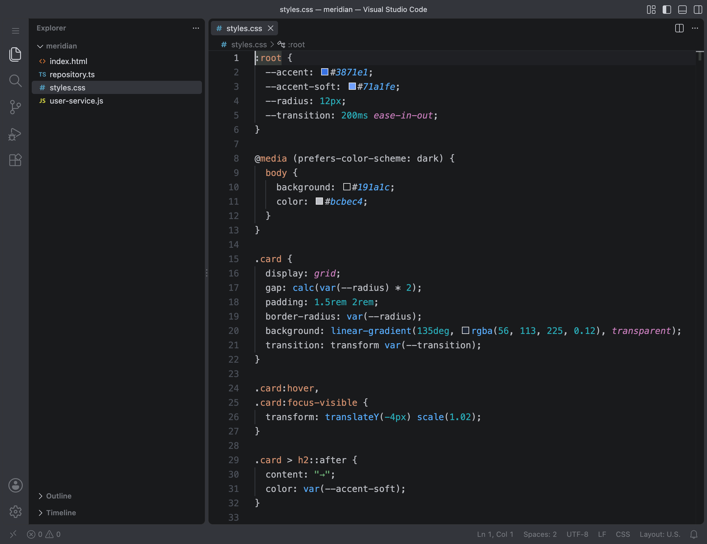

# Meridian Dark Suite

Meridian is a TypeScript-first design system and a precisely calibrated dark theme for VS Code. Instead of maintaining giant JSON blobs full of hardcoded hex values, Meridian defines colors procedurally using a strict compiler pipeline, ensuring perfect mathematical harmony across the entire workbench and code syntax.

## Features

- **Developer First:** Built entirely in TypeScript for perfect type-safety, testability, and long-term maintenance.
- **Semantic Engine:** Colors are mapped semantically (e.g., `surface.editor`), isolating abstract design from proprietary IDE implementation details.
- **Unified TextMate Mappings:** Arcane regex syntax scopes are grouped by logical language concepts, preventing UI fragmentation across different programming languages.
- **Zero Configuration:** Just install and use.

## Screenshots

Shown in **Meridian Dark**. All 13 variants share the same syntax colors and differ in the workbench palette and background (see [Variants](#variants)).



### JavaScript



### TypeScript



### HTML



### CSS



## Variants

All variants share the same syntax colors and differ in the workbench palette and background.

| Variant | Editor background |
|---------|-------------------|
| Meridian Dark | `#191A1C` |
| Meridian Dark Ultimate | `#1F1F1F` |
| Meridian Dark Slate | `#191A1C` |
| Meridian Dark Noir | `#05070E` |
| Meridian Dark Fire | `#130A07` |
| Meridian Dark Luxe | `#12100A` |
| Meridian Dark Elegance | `#181511` |
| Meridian Dark Midnight Glow | `#0C0A11` |
| Meridian Dark Umbra | `#0E0D1F` |
| Meridian Dark Polar Night | `#0D1721` |
| Meridian Dark Deep Sea | `#04110C` |
| Meridian Dark Deep Wine | `#1A0A14` |
| Meridian Dark Forest | `#10190A` |

## Installation

1. Open VS Code.
2. Go to the Extensions view (`Cmd+Shift+X` or `Ctrl+Shift+X`).
3. Search for **Meridian** and click **Install**.
4. Open the Command Palette (`Cmd+Shift+P` or `Ctrl+Shift+P`), run **Preferences: Color Theme**, and pick a Meridian variant.

## Build Instructions

Only needed if you want to work on the theme itself. Meridian operates exactly like a compiler target: you compile the TypeScript into the final VS Code JSON theme.

To build the JSON theme artifact locally:
```bash
pnpm install
pnpm run build
```
This generates the raw theme inside `themes/meridian-dark-color-theme.json`.

To package the theme into a distributable VS Code extension (`.vsix`):
```bash
pnpm run release:local
```

## Documentation

Meridian is built with a custom compiler pipeline. To understand how it works or how to contribute, please refer to our documentation:

- [Architecture](docs/architecture.md): High-level overview of the design system layers and data flow.
- [Compiler Pipeline](docs/compiler.md): Details on the incremental build system and dependency tracking.
- [Theme Generation](docs/theme-generation.md): How abstract tokens are resolved into VS Code JSON.
- [Development Workflow](docs/development.md): Setup, watch mode, and quality assurance tools.
- [Contributing](docs/contributing.md): Guidelines for modifying UI colors, syntax scopes, and creating new themes.

## Project Roadmap

- [x] Primitive Color System (Immutable color scales)
- [x] Semantic Abstraction Layer (UI and Syntax mapping)
- [x] VS Code Workbench Implementation
- [x] Unified TextMate Grammar Grouping
- [x] Strict Compiler & JSON Emission Pipeline
- [x] Vitest Validation Suite
- [x] GitHub Actions CI Pipeline
- [ ] WCAG Contrast and Accessibility Validation Step
- [ ] Meridian Light Theme Variant
- [ ] High-Contrast Variants for visually impaired developers
- [ ] Export engine for JetBrains and Zed editors

## License

This project is licensed under the MIT License - see the [LICENSE](LICENSE) file for details.
